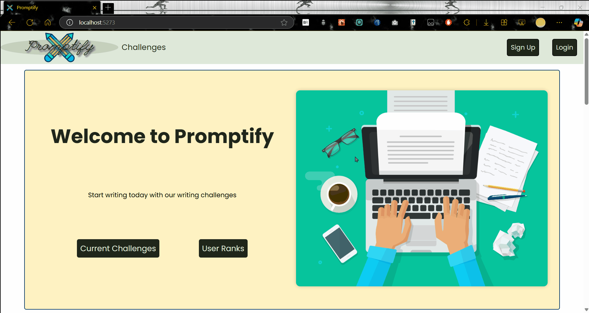
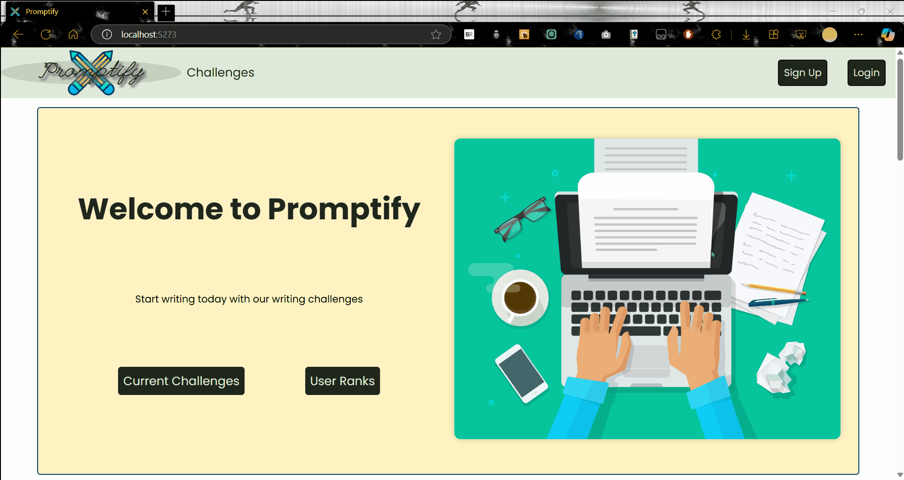
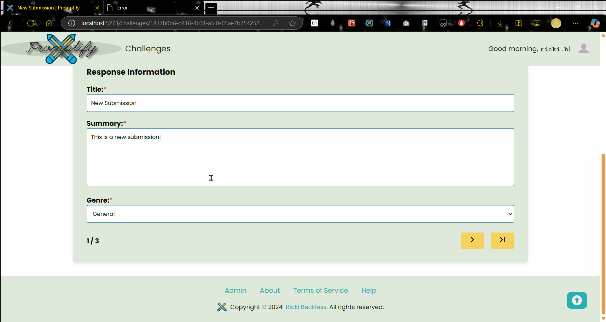

# Promptify

CodePath WEB103 Final Project

Designed and developed by: Ricki Beckless

🔗 Link to deployed app:

## About

### Description and Purpose

**Promptify** is a dynamic writing platform where users can participate in creative writing challenges and prompts. Designed for writers of all skill levels, users can sort challenges by tags such as *Beginner*, *Intermediate*, or *Advanced* based on their preferences. Users can create prompts for short stories or poetry, categorized by skill level and genre. Once a challenge is posted, participants have a set time to submit their responses. During the active period, users can vote on their favorite submissions, and the highest-voted entry is declared the winner.

### Inspiration

As an avid writer who loves a challenge but often struggles with writer's block, I aspired to create an engaging platform to foster collaboration between like-minded writers and inspire creativity and excitement in the writing process.

## Tech Stack

Frontend: Vite + React, React Router

Backend: Node.js + Express.js, Railway + PostgreSQL

## Features

### ✅ User Creation and Authentication

> This feature supports user authentication, fulfilling the requirement of having a well-designed RESTful API for POST requests (account creation).

> To support the ability to reset the database to its default state admin status is required.

Users can easily create an account which allows them to participate in writing challenges and leave feedback on others submissions. The authentication process requires the user to submit a *unique* username, *unique* email address, and a password that follows the specified guidelines. Passwords are encrypted using JSON Web Tokens.
- *users do **not** need to create an account to access the platform, but will need to be signed-in to participate in challenges.*

#### Login Gif

#### Signup Gif

### User Profiles

> Profiles implement a one-to-many relationship (users to submissions), highlighting the database schema requirements.

> The implementation of badges demonstrates data generation in response to user actions, meeting custom feature criteria.

Each user has a personalized profile that showcases their writing, including completed challenges, submissions, and received feedback. The user profile will also be where the badges a user has earned will be displayed. Some additional profile features include creating a short "About Me" and profile pictures.
- *users earn badges for creating challenges, completing challenges, receiving votes, and providing feedback (comments and votes).*

[gif goes here]

### ✅ Writing Challenges

> This feature demonstrates the implementation of dynamic routes for creating and accessing challenges, fulfilling the need for GET, POST, and DELETE requests.

Users can create and participate in a variety of writing challenges and prompts. Challenges can cover different styles (poetry, short-story), genres (creative, fantasy, non-fiction, thriller), and limitations (timed writing, required phrases, word or character count restrictions).
- *challenges are automatically ended, and final votes are calculated, with notifications sent to the winning users.*

#### Challenge Creation/GET Gif

### ✅ Challenge Labels/Tagging

> Tags serve as a filtering feature, allowing users to easily search for challenges that match their preferences, fulfilling a custom feature requirement.

To enhance discoverability, all challenges are labeled with skill levels (Beginner, Intermediate, Advanced), genre tags, and (if applicable) a limitation tag. This system allows users to quickly find prompts that align with their interests and skill sets.

#### Challenge Tags Gif

### ✅ Time-Restricted Challenges

Challenges are given time limits that specify when the challenge begins and how long it will be active. Users participating in the challenge must submit their responses within the allotted timeframe. After the challenge ends, there will be a short time for final votes before the winner is declared.

#### Timed Challenge Gif

### ✅ Commenting and Voting System

> This feature incorporates a many-to-many relationship with a join table (votes) between users and submissions, meeting database relationship requirements.

> This feature also demonstrates how users can interact with submissions without navigating away from the current page, fulfilling a requirement for user-initiated interactions.

Engagement is encouraged through a voting system where users can upvote their favorite submissions during active challenges. The submission with the most votes at the end of the challenge is declared the winner. Users are also able to comment on a submission.
- *while users can upvote a submission, they cannot downvote.*
- *both signed-in users and guests can vote on a submission, but guest votes will not be used to determine the winner.*

[gif goes here]

### ✅ User Notifications

To keep users informed and engaged, the app provides personalized notifications for new challenges, comments and votes on their submissions, and when a challenge they participated in final votes are published.
- *users can choose what new challenges to be notified of, by default they are not notified of new challenges.*

[gif goes here]

## Installation Instructions

[instructions go here]
