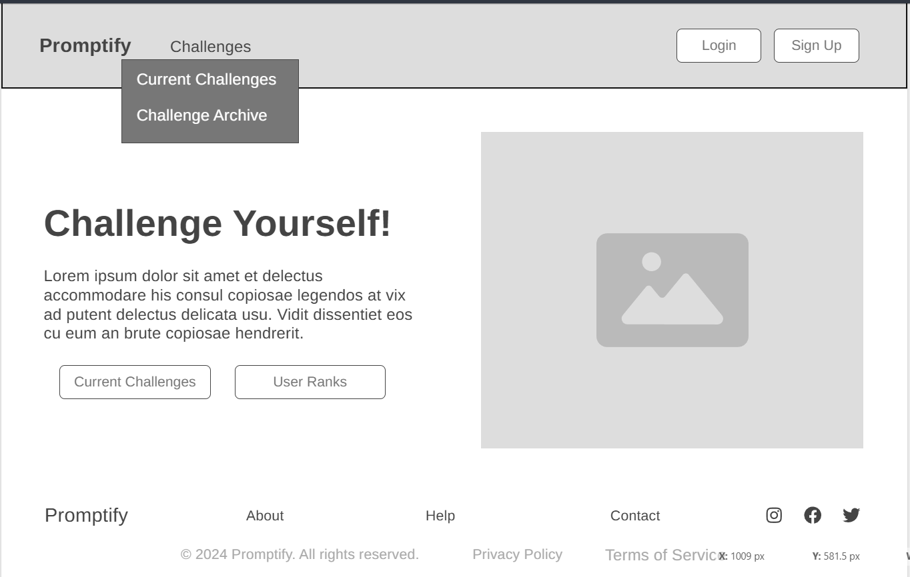

# Wireframes

Reference the Creating an Entity Relationship Diagram final project guide in the course portal for more information about how to complete this deliverable.

## List of Pages

[👉🏾👉🏾👉🏾 List the pages you expect to have in your app, with a ⭐ next to pages you have wireframed]

- Home ⭐
- Profile
- All Challenges
- Challenge Details
- Create Challenge
- Create Submission
- Submission Details
- Notifications
- Challenge Archive

## Wireframe 1: Home

## Wireframe 2: Profile

[👉🏾👉🏾👉🏾 include wireframe 2]

## Wireframe 3: All Challenges

[👉🏾👉🏾👉🏾 include wireframe 3]

## Wireframe 4: Challenge Details

[👉🏾👉🏾👉🏾 include wireframe 4]

## Wireframe 5: Create Challenge

[👉🏾👉🏾👉🏾 include wireframe 5]

## Wireframe 6: Create Submission

[👉🏾👉🏾👉🏾 include wireframe 6]

## Wireframe 7: Submission Details

[👉🏾👉🏾👉🏾 include wireframe 7]

## Wireframe 8: Notifications

[👉🏾👉🏾👉🏾 include wireframe 8]

## Wireframe 9: Challenge Archive

[👉🏾👉🏾👉🏾 include wireframe 9]

[👉🏾👉🏾👉🏾 include more wireframes as desired]
